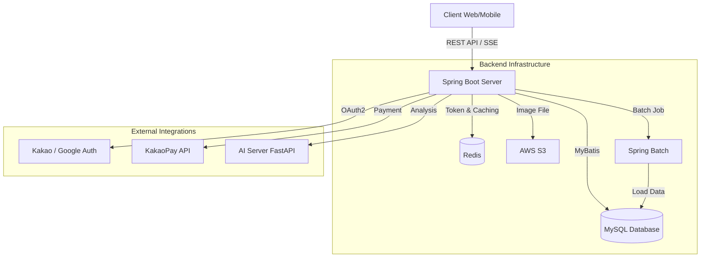

# Match-Meal Backend Service 🥗

Match-Meal 프로젝트의 백엔드 서비스입니다.

사용자의 식단 기록, 건강 관리, 커뮤니티, 챌린지 기능을 제공하며, AI 서버와 연동하여 맞춤형 피드백을 제공합니다.

## 🛠 Tech Stack

### Environment

* **Java**: 17
* **Framework**: Spring Boot 3.4.12
* **Build Tool**: Gradle

### Database & Storage

* **MySQL 8.0**: 사용자, 식단, 게시글 등 메인 데이터 저장
* **Redis**: JWT Refresh Token 관리 (RTR), 랭킹 데이터 캐싱
* **AWS S3**: 프로필, 식단, 게시글 이미지 파일 스토리지

### Security & Authentication

* **Spring Security**: 보안 설정 및 권한 관리
* **OAuth2 Client**: 소셜 로그인 (Kakao, Google)
* **JWT (JSON Web Token)**: Stateless 인증 (Access/Refresh Token)

### Data Access & Processing

* **MyBatis 3.0.5**: SQL 매핑 및 데이터 처리
* **Spring Batch**: 대용량 음식 데이터(CSV) 일괄 처리 및 적재

### Communication

* **Spring WebFlux (WebClient)**: AI 서버(FastAPI) 및 외부 API 비동기 통신
* **SSE (Server-Sent Events)**: 실시간 랭킹 스트리밍 제공

### API Documentation

* **SpringDoc OpenAPI (Swagger)**: API 명세서 자동화 (`/swagger-ui/index.html`)

---

## 🏗 System Architecture



---

## 💡 Key Features

### 1. 사용자 (User)

* **소셜 로그인**: OAuth2를 이용한 카카오, 구글 로그인 지원.
* **추가 정보**: 키, 몸무게, 알레르기, 지병 등 건강 정보 관리.
* **마이페이지**: 프로필 수정, 포인트 및 결제 내역 확인.

### 2. 식단 관리 (Diet)

* **식단 기록**: 아침/점심/저녁/간식 구분, 다중 이미지 업로드.
* **영양 분석**: 음식 데이터베이스를 기반으로 칼로리 및 영양소(탄/단/지/당/나) 자동 계산.
* **점수 시스템**: 섭취 영양소에 따른 식단 점수 산정 및 통계 제공.

### 3. 커뮤니티 (Community)

* **게시판**: 자유, 질문, 정보, 식단 공유 카테고리별 게시글 작성.
* **소통**: 댓글/대댓글 기능, 좋아요, 조회수(Cookie 기반 중복 방지).
* **팔로우/피드**: 유저 간 팔로우 기능 및 팔로잉 유저의 식단 피드 조회.

### 4. 챌린지 & 랭킹 (Challenge)

* **그룹 챌린지**: 기간, 목표(칼로리, 빈도 등), 인원 제한을 설정하여 챌린지 생성 및 참여.
* **실시간 랭킹**: 많이 먹은 음식 등에 대한 랭킹 정보를 SSE로 실시간 전송.

### 5. AI 서비스 (AI Integration)

* **식단 상담**: 사용자의 식단 기록을 바탕으로 AI와 채팅 상담.
* **피드백**: 기간별 식단 분석 및 개선점 제안, 메뉴 추천 기능.

### 6. 결제 (Payment)

* **카카오페이 연동**: 프리미엄 구독 서비스 결제 (준비, 승인, 취소, 실패 처리).
* **자동 결제**: 스케줄러를 통한 정기 결제 관리.

---

## 📂 Project Structure

```
src/main/java/com/pagoda/matchmeal
├── common/             # 공통 설정 및 유틸리티
│   ├── config/         # Spring 설정 (Security, Swagger, Redis 등)
│   ├── exception/      # 전역 예외 처리 (GlobalExceptionHandler)
│   ├── response/       # 공통 응답 포맷 (CommonResponse)
│   └── util/           # 유틸리티 클래스 (Cookie, API 등)
├── controller/         # API 엔드포인트 (Controller Layer)
├── service/            # 비즈니스 로직 (Service Layer & Impl)
├── mapper/             # 데이터 접근 계층 (MyBatis Mapper)
├── model/              # 데이터 객체
│   ├── entity/         # DB 엔티티
│   ├── dto/            # 데이터 전송 객체 (Request/Response)
│   └── enums/          # 상수 열거형 (Role, Status 등)
└── scheduler/          # 정기 작업 (결제, 알림, 랭킹 초기화 등)

```

---

## 🚀 Getting Started

### Prerequisites

* JDK 17 이상
* MySQL, Redis 실행 중
* AWS S3 버킷 생성 및 키 발급

### Environment Setup (`application.yml`)

실행 전 환경 변수 설정이 필요합니다.

```yaml
spring:
  datasource:
    url: jdbc:mysql://localhost:3306/matchmeal
    username: ${DB_USERNAME}
    password: ${DB_PASSWORD}
  data:
    redis:
      host: localhost
      port: 6379
  security:
    oauth2:
      client:
        registration:
          kakao: # Client ID/Secret
          google: # Client ID/Secret
cloud:
  aws:
    credentials:
      access-key: ${AWS_ACCESS_KEY}
      secret-key: ${AWS_SECRET_KEY}

```

### Build & Run

```bash
# Build
./gradlew build -x test

# Run
java -jar build/libs/matchmeal-0.0.1-SNAPSHOT.jar

```